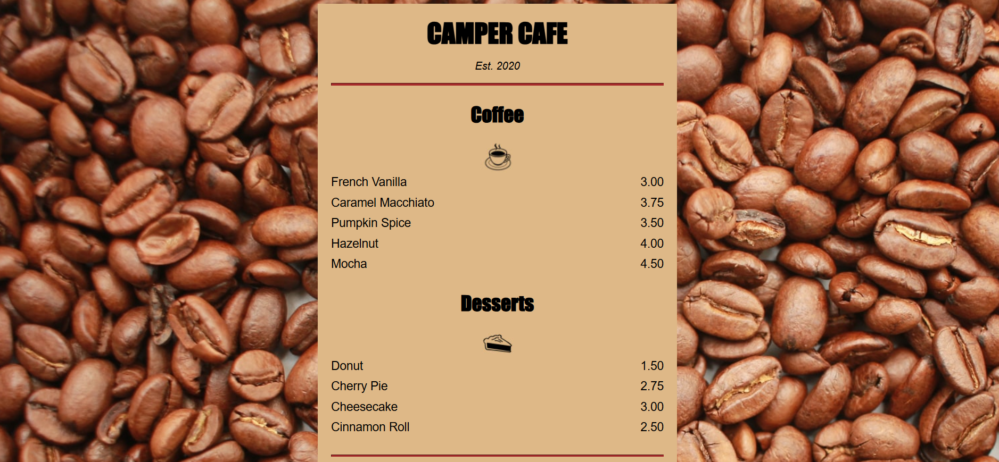

# ☕ Camper Cafe Menu Website

A simple and elegant **HTML + CSS** website displaying a coffee shop menu.  
This project demonstrates the use of basic **HTML structure**, **CSS styling**, and **background images** to create an appealing static web page.

---

## 🖼️ Project Preview

---

## 🌟 Features

- 📜 Beautifully styled **coffee and dessert menu**
- ☕ Clean and minimal **layout**
- 🎨 Custom **background image** for an authentic cafe vibe
- 💻 Fully **responsive design** for various screen sizes
- 🪶 Built using **pure HTML and CSS** (no frameworks)

---

## 🧩 Technologies Used

| Technology | Purpose |
|-------------|----------|
| **HTML5** | Structure and content |
| **CSS3** | Styling and layout |
| **VS Code** | Code editor used for development |

---
